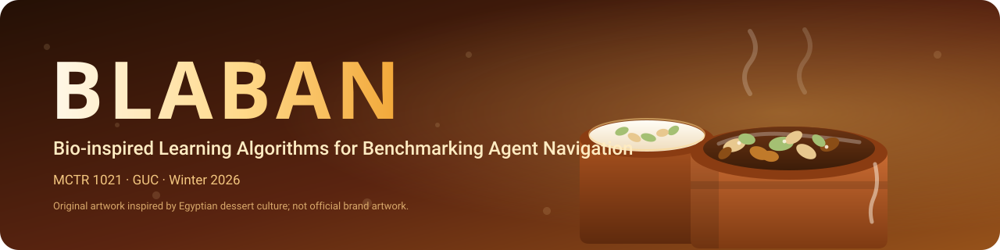

<div align="center">
  
</div>

<div align="center">

[](https://www.python.org/)
[](tests/)
[](pyproject.toml)
[](LICENSE)
[](#roadmap)

[](https://github.com/NoureldinAbdelrahman/blaban-18/stargazers)
[](https://github.com/NoureldinAbdelrahman/blaban-18/commits)
[](https://github.com/NoureldinAbdelrahman/blaban-18/issues)
[](#contributing)

**B**io-inspired **L**earning **A**lgorithms for **B**enchmarking **A**gent **N**avigation

*MCTR 1021 — Optimization Techniques for Multi-Cooperative Systems · GUC · Winter 2026 · Team 18*

</div>

---

## What is BLABAN?

**BLABAN** is a research toolkit for solving **multi-agent cooperative
optimization** problems — autonomous vehicles, UAVs, UGVs and robot fleets —
with **metaheuristic optimization**. It pairs a curated literature corpus with a
modular problem/algorithm architecture so that every optimizer is benchmarked on
the same formulation, the same metrics and the same reproducibility harness.

> The aim: generate optimal or near-optimal solutions for real, constrained
> problems in multi-agent systems, and rigorously compare trajectory-based,
> evolutionary and swarm-based search.

## Highlights

- **21-paper curated corpus** with structured review notes and a BibTeX catalog.
- **Uniform optimizer interface** — implement once, benchmark everywhere.
- **Milestone-driven**: SA → GA → swarm (PSO/ACO/WOA/GWO) → novel metaheuristic.
- **Reproducible experiments**: config-driven runs, seeded RNG, logged results.
- **Report-ready outputs**: publication-style figures, tables and statistics.

## Repository layout

```
.
├── docs/
│   ├── assets/banner.svg        # repo banner
│   ├── instructions/            # parsed course brief
│   ├── milestones.md            # milestone checklist (1–6)
│   └── templates/               # proposal + literature-note templates
├── literature/
│   ├── papers/                  # 21 curated course PDFs (stable ids)
│   ├── notes/                   # one structured note per paper
│   ├── reviews/                 # literature survey + review tracker
│   └── bibliography/            # catalog.json, references.bib/.md, manifest.csv
├── proposals/                   # idea_1.md, idea_2.md, compiled proposal
├── src/blaban/                  # the BLABAN Python package
│   ├── problems/                # problem formulation            (M2)
│   ├── algorithms/
│   │   ├── simulated_annealing/ # SA                             (M3)
│   │   ├── genetic_algorithm/   # GA                             (M4)
│   │   ├── swarm/               # PSO / ACO / WOA / GWO          (M5)
│   │   └── novel/               # new population-based method    (M6)
│   ├── common/                  # shared types, objectives, constraints
│   ├── visualization/           # plotting and animation
│   └── experiments/             # configs + benchmark harness
├── data/{raw,processed}/        # datasets (not tracked)
├── results/{figures,tables,logs}/
├── reports/                     # milestone writeups, IEEE report, poster
├── scripts/                     # literature + bibliography tooling
└── tests/                       # pytest suites
```

## Workflow

1. **Read the brief** — `docs/instructions/project_overview.md`; track progress in
   `docs/milestones.md`.
2. **Review papers** — fill the pre-generated notes in `literature/notes/`
   (template: `docs/templates/literature_note_template.md`), updating
   `status`/`relevance` in each note's frontmatter.
3. **Pick two ideas** — draft `proposals/idea_1.md` and `proposals/idea_2.md`, then
   compile the 2-page `proposals/proposal.md`.
4. **Formulate (M2)** — implement the problem model in `src/blaban/problems/` with
   tests in `tests/`.
5. **Implement algorithms (M3–M6)** under `src/blaban/algorithms/`, driving runs
   from `src/blaban/experiments/` and writing outputs to `results/`.
6. **Report** — keep milestone writeups in `reports/`; final 6-page IEEE-format
   LaTeX paper in `reports/milestone6_final/`.

## Quickstart

```bash
git clone https://github.com/NoureldinAbdelrahman/blaban-18.git
cd blaban-18

python -m venv .venv && source .venv/bin/activate
pip install -r requirements.txt
pip install -e ".[dev]"      # editable install + pytest/ruff
pytest
```

## Literature tooling

```bash
# Heuristic metadata extraction from the PDFs (review the output)
python scripts/extract_paper_metadata.py

# Rebuild papers/, catalog.json, references.bib/.md, manifest.csv and notes
python scripts/build_bibliography.py            # --force to overwrite notes
```

The canonical metadata lives in the `CURATED` table of
`scripts/build_bibliography.py`; `catalog.json` is generated from it.

## Roadmap

| Milestone | Deliverable | Algorithm / artifact | Weight | Due |
| --- | --- | --- | --- | --- |
| 1 | 2-page proposal (2 ideas) | `proposals/` | 3% | 1 Oct 2026 |
| 2 | Literature survey + formulation | `src/blaban/problems/` | 5% | 8 Oct 2026 |
| 3 | Simulated Annealing | `src/blaban/algorithms/simulated_annealing/` | 6% | 19 Oct 2026 |
| 4 | Genetic Algorithm | `src/blaban/algorithms/genetic_algorithm/` | 8% | 11 Nov 2026 |
| 5 | PSO / ACO / WOA / GWO | `src/blaban/algorithms/swarm/` | 8% | 2 Dec 2026 |
| 6 | Novel metaheuristic + report + poster | `src/blaban/algorithms/novel/` | 10% | 17 Dec 2026 |

## Tech stack

**Python 3.10+** · NumPy · SciPy · Matplotlib · Pandas · pytest · ruff

## Contributing

This is a course project (Team 18). Branch per milestone, keep experiments
reproducible, run `pytest` and `ruff check .` before opening a PR.

## Citation

If you reference this work, see [`CITATION.cff`](CITATION.cff).

## License

Released under the [MIT License](LICENSE).
