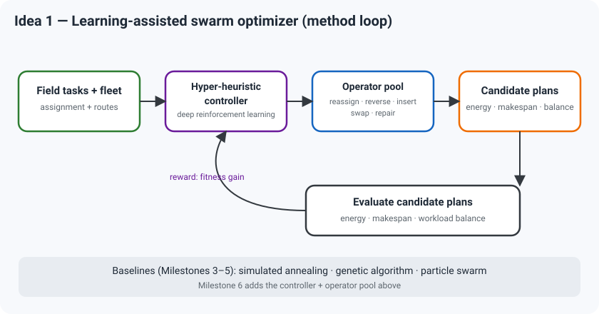

# Project Idea #1 (Priority)

**Title:** Learning-Assisted Swarm Optimization for Cooperative Agricultural Ground Robots

## Setting

A ground-robot fleet monitors a field: soil sampling, weed mapping, pest scouting.
See Use Case A in `proposals/use_case.md`.

## Problem

Assign sensing tasks and plan routes jointly to cut energy and mission time under
sensor-match, battery, row, time-window, and precedence constraints.

## Research question

Can a swarm optimizer whose search phases are steered by deep reinforcement
learning beat fixed-schedule and classical metaheuristics on this constrained
agricultural planning problem?

## Why it matters

- Field robots are energy-limited and heterogeneous; bad plans waste battery and
  miss spray windows.
- Reviewed work adapts search, but rarely learns the strategy online — and almost
  never with explicit energy.
- The method maps cleanly onto the course milestones below.

## Approach

- Variables: task-to-robot assignment, per-robot visit order.
- Objectives: energy, makespan, workload balance.
- Constraints: sensor match, battery, no-go rows, time windows, scout-before-spray.
- Method: particle swarm base (Milestone 5); a deep reinforcement learning
  controller selects search phases and operators (final Milestone plus the
  machine-learning bonus). Simulated annealing and the genetic algorithm serve as
  baselines (Milestones 3–4). The final optimizer stays population-based, so the
  milestone rule holds; learning only steers strategy.

## Novelty

Online strategy selection plus explicit energy on a constrained agricultural
planning problem — absent from the reviewed work.

## Metrics

Energy, makespan, balance, coverage, runtime; ablation of the controller;
repeated runs with statistical tests.

## References

1. Qin et al. 2025. Drones. https://doi.org/10.3390/drones9060436
2. Nait Chabane and Guenounou 2025. Complex and Intelligent Systems. https://doi.org/10.1007/s40747-025-02062-w
3. Cheng et al. 2024. Complex System Modeling and Simulation. https://doi.org/10.23919/CSMS.2024.0006
